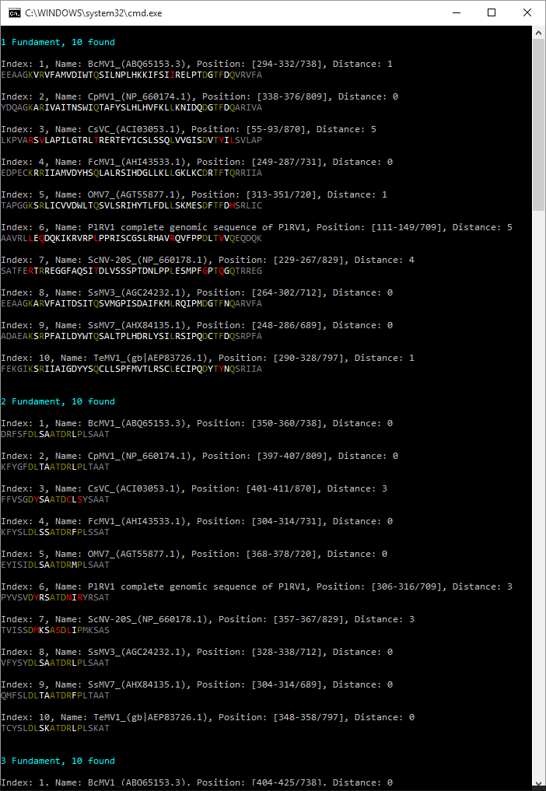

# Protein Alignment Matcher

Evening project that helps to find matching protein sequences with tolerance to errors.

[Wiki Details on sequence alignment](https://en.wikipedia.org/wiki/Sequence_alignment)

Pattern matcher uses patterns such as `K1R9Q13L5D1TF1Q` where letters are 
protein names and numbers are spaces between.

So far we support only FASTA file type as input and Console as output.

Outputs of CSV, Excel, HTML are planned.

## CLI

All arguments:

	f|file - File Name
	t|fileType - File Type (FASTA)
	e|exporter - Exporter Type (CONSOLE)
	d|maximalDistance - Maximum allowed distance between pattern and found protein sequence
	p|pattern - patterns (can be N) to search by

## Example

	ProteinFundamentSearcher.Console.exe -f "file.fasta" -p "K1R9Q13L5D1TF1Q" -p "DL2ATDR1P" -p "GQP1G3SW6HH2V" -p "Y3GDD2I4VA2Y" -p "V1I3K3S5EFAKR"
	
### Result
	
